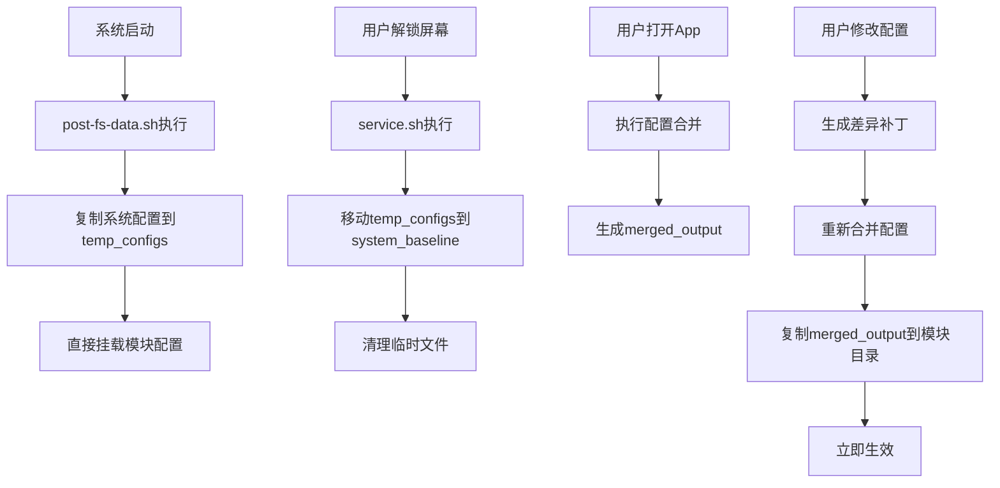

# ColorFeatureEnhance 配置管理系统重新设计方案

## 项目背景

### 当前问题
- 直接修改模块中的系统配置文件导致OTA更新时无法获取最新系统配置
- 需要设计一个既能实现功能定制，又能在系统更新时自动合并原始文件变更的方案

### 解决思路
采用**分层配置架构 + 差异化补丁系统**，实现系统配置与用户自定义的分离管理和智能合并。

## 核心架构设计

### 1. 目录结构设计（优化版）

```
/data/media/0/Android/data/com.itosfish.colorfeatureenhance/files/
└── configs/
    ├── system_baseline/              # 系统原始配置（service脚本更新）
    │   ├── com.oplus.app-features.xml
    │   ├── com.oplus.oplus-feature.xml
    │   └── last_copy.txt            # 复制时间戳
    ├── user_patches/                # 用户差异补丁
    │   ├── app-features.patch.json
    │   └── oplus-features.patch.json
    └── merged_output/               # 合并后的最终配置
        ├── com.oplus.app-features.xml
        └── com.oplus.oplus-feature.xml

/data/adb/modules/ColorOSFeaturesEnhance/
├── module.prop
├── post-fs-data.sh                 # 启动脚本（复制系统配置到临时目录）
├── service.sh                      # 服务脚本（移动临时配置到app存储）
├── temp_configs/                   # 临时配置目录（post-fs-data阶段使用）
│   ├── com.oplus.app-features.xml
│   ├── com.oplus.oplus-feature.xml
│   └── last_copy.txt
├── my_product/etc/extension/        # 主挂载目标
│   ├── com.oplus.app-features.xml
│   └── com.oplus.oplus-feature.xml
└── anymount/my_product/etc/extension/ # 备用挂载目标
    ├── com.oplus.app-features.xml
    └── com.oplus.oplus-feature.xml
```

### 2. 数据流设计（优化版）



### 3. 配置文件类型分析

#### app-features.xml (5种类型)
1. **简单布尔特性**: `<app_feature name="xxx"/>`
2. **布尔参数特性**: `<app_feature name="xxx" args="boolean:true"/>`
3. **参数配置特性**: `<app_feature name="xxx" args="int:1|float:0.4|String:xxx"/>`
4. **复杂子节点特性**: `<app_feature name="xxx"><StringList args="..."/></app_feature>`
5. **混合特性**: `<app_feature name="xxx" args="StringList:pkgs"><StringList name="pkgs" args="..."/></app_feature>`

#### oplus-feature.xml (2种类型)
1. **启用特性**: `<oplus-feature name="特性名"/>`
2. **禁用特性**: `<unavailable-oplus-feature name="特性名"/>`

## 实施计划

### 阶段1: 重新设计配置管理架构 [当前进行中]
- [x] 分析现有代码结构和问题
- [x] 设计新的目录结构和数据流
- [x] 更新模块脚本 (post-fs-data.sh)
- [ ] 完成架构设计文档

### 阶段2: 重写ConfigUtils配置工具类
- [ ] 移除所有旧的兼容逻辑
- [ ] 实现新的目录初始化功能
- [ ] 实现配置文件复制和权限管理
- [ ] 添加错误处理和日志记录

### 阶段3: 完善ConfigMergeManager合并引擎
- [ ] 实现XML解析器（支持5种app-feature类型）
- [ ] 实现差异计算算法
- [ ] 实现智能合并算法
- [ ] 实现补丁生成和应用逻辑
- [ ] 添加冲突检测和解决机制

### 阶段4: 重构MainActivity集成逻辑
- [ ] 移除旧的配置初始化代码
- [ ] 集成新的ConfigMergeManager
- [ ] 添加配置合并状态检查
- [ ] 更新UI反馈机制

### 阶段5: 更新Repository层适配
- [ ] 修改XmlFeatureRepository适配新架构
- [ ] 修改XmlOplusFeatureRepository适配新架构
- [ ] 更新配置文件路径引用
- [ ] 确保数据一致性

## 技术细节

### 差异补丁数据结构
```kotlin
@Serializable
data class ConfigPatch(
    val version: String,
    val timestamp: Long,
    val appFeaturePatches: List<AppFeaturePatch>,
    val oplusFeaturePatches: List<OplusFeaturePatch>
)

@Serializable
sealed class AppFeaturePatch {
    data class SimpleBoolean(val name: String, val action: PatchAction) : AppFeaturePatch()
    data class BooleanWithArgs(val name: String, val enabled: Boolean, val action: PatchAction) : AppFeaturePatch()
    data class ParameterConfig(val name: String, val args: String, val action: PatchAction) : AppFeaturePatch()
    data class ComplexConfig(val name: String, val subNodes: List<FeatureSubNode>, val action: PatchAction) : AppFeaturePatch()
    data class MixedConfig(val name: String, val args: String?, val subNodes: List<FeatureSubNode>, val action: PatchAction) : AppFeaturePatch()
}

@Serializable
sealed class OplusFeaturePatch {
    data class EnableFeature(val name: String) : OplusFeaturePatch()
    data class DisableFeature(val name: String) : OplusFeaturePatch()
    data class RemoveFeature(val name: String) : OplusFeaturePatch()
}
```

### 合并算法策略
- **app-features类型1-3**: 直接覆盖策略（用户配置优先）
- **app-features类型4**: 子节点级别的增量合并
- **app-features类型5**: args属性 + 子节点的混合合并
- **oplus-features**: 简单的启用/禁用/移除操作

## 预期效果

1. **OTA兼容性**: 系统更新后自动获取最新配置并重新合并
2. **用户体验**: 保持现有的编辑界面，后台自动处理复杂逻辑
3. **数据安全**: 用户配置以补丁形式保存，不会丢失
4. **性能优化**: 只在必要时进行合并操作
5. **可维护性**: 清晰的架构分层，便于后续扩展

## 风险评估

### 潜在风险
1. **兼容性**: 完全重写可能影响现有用户数据
2. **复杂性**: 新架构增加了系统复杂度
3. **测试**: 需要充分测试各种配置组合

### 缓解措施
1. 提供数据迁移工具
2. 分阶段实施，确保每个阶段都能独立工作
3. 建立完整的测试用例覆盖

## 时间估算
- **总工作量**: 12-15个工作日
- **阶段1**: 2-3天 (架构设计)
- **阶段2**: 2-3天 (ConfigUtils重写)
- **阶段3**: 4-5天 (合并引擎实现)
- **阶段4**: 2天 (MainActivity集成)
- **阶段5**: 2天 (Repository层适配)
